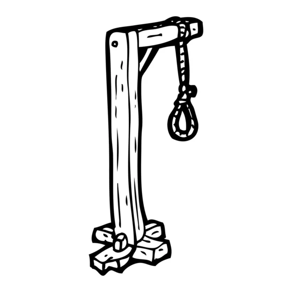

# Juego del ahorcado

# Tecnologias
- HTML
- CSS
- JAVASCRIPT

# Responsive para las siguientes dimensiones
- 360px
- 768px
- 1280px
- 1536px
- 1920px

# Descripcion del proyecto
Juego hecho con HTML, CSS, JavaScript y SASS. He implementado tres niveles de dificultad, con música de fondo, sonidos al acertar o fallar, y música de victoria o derrota. Para el audio, he utilizado la librería Howler. ¡Si desea modificar algo, siéntase libre de hacerlo!

# Modo de uso
Clona el repositorio en tu ordenador, ejecútalo en tu editor de código, abre una terminal y ejecuta el siguiente comando: npm run dev.

# Contribución
Cualquier sugerencia o problema que encuentres no dudes en compartirlo! Gracias!!